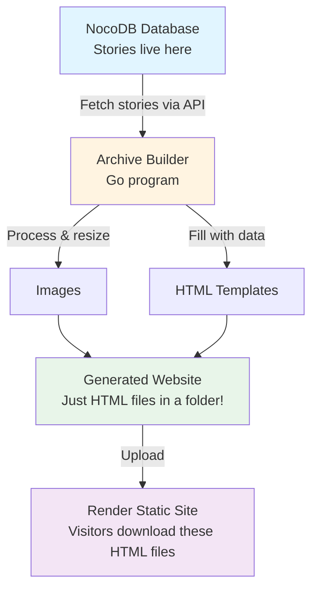
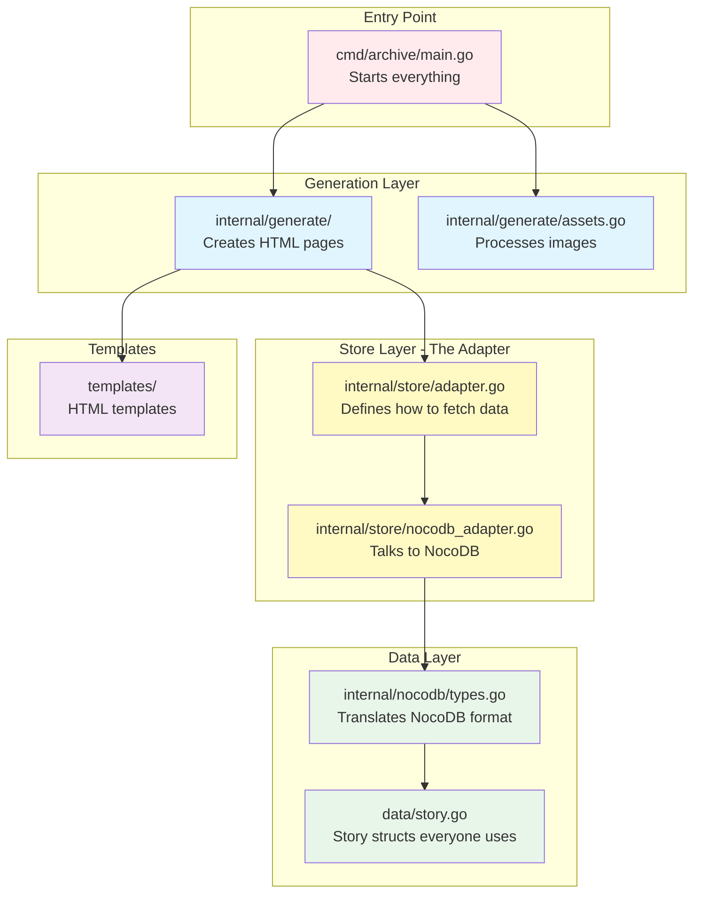
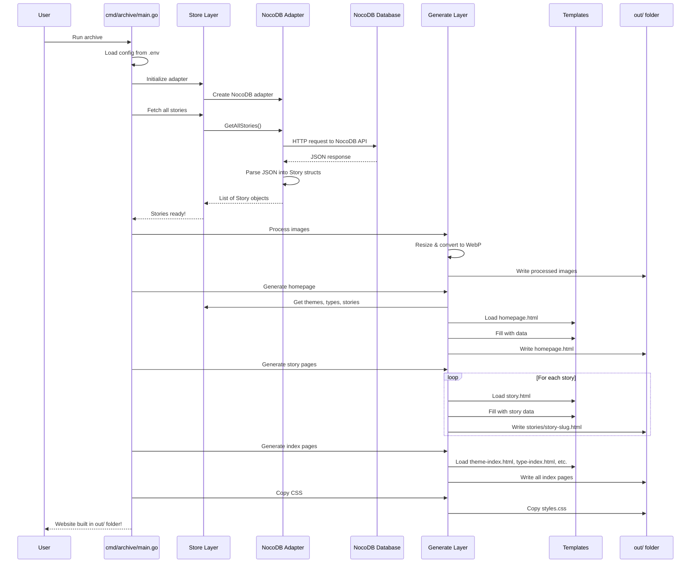
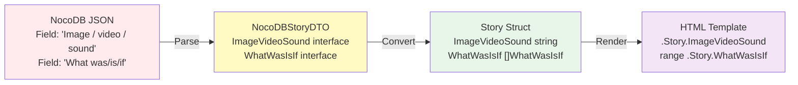
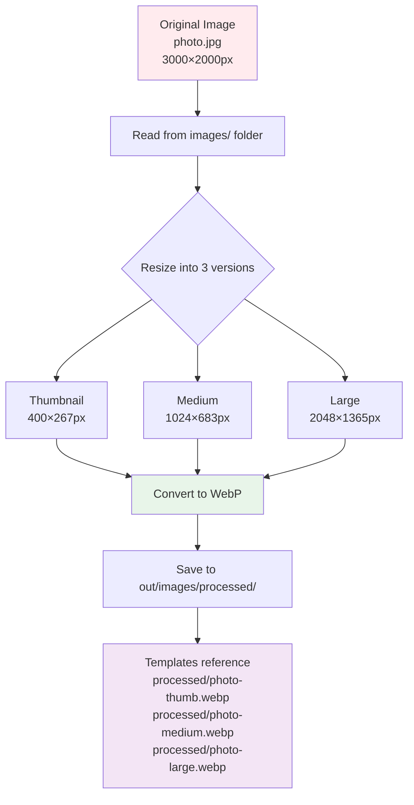
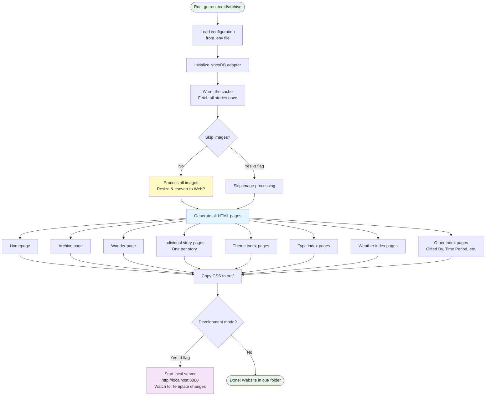

# Dudley Climate Justice Archive

## Status

At the time of writing, this contains the first version of the archive. This is intended for release in Spring 2025.

## Technology Choices

### Go

[Go](https://go.dev/) was chosen for this project because of its simplicity, maintainability, high quality and low carbon footprint. In comparison to higher level languages like Python and JavaScript, Go is a compiled language, which makes it more efficient in terms of energy consumption.

### SQLite

The ulimate aim in this project was to use SQLite as the database backend.

[SQLite](https://www.sqlite.org/index.html) was chosen for this project because it is a lightweight, disk-based database. It allows us to keep all of the archive's data in a single file, making it easier to store and transport. 

In the event of a climate collapse, the database will still be readable and usable and can easily be reproduced.

In comparison to a more traditional database like PostgreSQL, SQLite is also more energy efficient.

The eventual ambition is for the project itself to contain its own backend which uses NocoDB. Currently NocoDB is used as an interface for the backend of the archive, which does ultimately write to a SQLite database stored on disk. At some point we will replace calls to the NocoDB API with direct reads of an SQLite database, but it was decided that this was too much complexity for now, as the NocoDB interface provided a lot of power.

Accessing the NocoDB database directly from SQLite clients is possible, so the archive does not ultimate depend on NocoDB. All parts of the archive can therefore be replaced.

## How It All Works

This section explains how the archive takes story data from NocoDB and turns it into a complete static website. If you're new to maintaining the archive, this will help you understand how everything fits together.

### What's a Static Site?

Before we dive in, let's be clear about what "static site" means:

A **static site** is just a folder full of regular HTML files - like the websites from the early days of the internet. When someone visits the archive, their browser just downloads and displays these HTML files directly. There's no database query happening, no server generating pages on-the-fly.

**Think of it like this:**
- **Dynamic sites** (like Facebook): When you visit, the server runs code, fetches data from a database, builds the page right then, and sends it to you. Different every time!
- **Static sites** (like this archive): All the pages are already built and sitting in a folder. When you visit, the server just sends you the pre-made HTML file. Simple!

**Why we use a static site:**
- **Fast**: No waiting for a server to build pages - they're already built
- **Simple**: Just HTML files, so you can host them almost anywhere
- **Resilient**: If something goes wrong with the hosting, you still have all your HTML files. Resilience against all kinds of disaster, especially climate related, is a key goal of this archive
- **Low energy**: Static files use way less server resources than dynamic sites
- **Future-proof**: In 20 years, HTML files will still work, even if the database software is obsolete

**The "Generator" Part:**
We don't write all those HTML files by hand! The archive *generates* them automatically from the NocoDB data and templates. You run the build command, it creates all the HTML files, and then those files get uploaded to Render for hosting.

So: **Database + Templates → Build Process → HTML Files → Upload to Render → Live Website!**

### The Big Picture

The archive is a **static site generator**. It fetches data from NocoDB, processes images, fills in HTML templates, and creates a complete website of HTML files. The generated site is then deployed to Render for hosting. No database or server-side code is needed once the site is built!



### The Architecture: Layers

The code is organised into layers, each with a specific job. This keeps things tidy and makes it easier to change one part without breaking others.



### How Data Flows: From Database to Website

Here's what happens when you run `go run ./cmd/archive`:



### The Store Layer: The Adapter Pattern

The store layer is like a translator. The rest of the code just asks "give me stories" and doesn't need to know if they're coming from NocoDB, SQLite, or anywhere else.

**Why we have this:**
- We can swap NocoDB for SQLite later without rewriting everything
- The code is cleaner because fetching data is separate from displaying it
- Testing is easier because we can create fake adapters

```go
// The interface - what the adapter promises to do
type DataAdapter interface {
    GetAllStories() ([]data.Story, error)
    GetStoryByID(id string) (data.Story, error)
    GetStoriesForTheme(theme string) ([]data.Story, error)
    // ... and so on
}

// The NocoDB version - how we do it right now
type NocoDBAdapter struct {
    client *nocodb.Client
}

// In the future, we might have:
type SQLiteAdapter struct {
    db *sql.DB
}
```

The rest of the code just uses `GetAdapter()` and doesn't care which adapter it is!

### How Stories Get Transformed

NocoDB sends data in one format, but we need it in another. Here's how a story transforms as it moves through the system:



**Step by step:**

1. **NocoDB JSON**: Raw data with field names like "Image / video / sound" (notice the spaces!)
2. **NocoDBStoryDTO**: A Go struct with json tags that match NocoDB's field names exactly
3. **Story Struct**: The proper struct everyone uses, with nice Go field names and proper types
4. **HTML Template**: The template accesses fields like `{{.Story.Finding}}` to display them

The conversion happens in `internal/nocodb/types.go`. It handles tricky things like:
- Converting `["Theme A", "Theme B"]` into proper Theme structs with URLs and colours
- Parsing attachment JSON into StoryAttachment objects
- Turning `null` into sensible defaults instead of crashing

### Image Processing Pipeline

Images need special treatment. We resize them into different sizes and convert them to WebP format (which loads faster and uses less bandwidth).



**Why WebP?**
- Much smaller file sizes than JPG or PNG
- Faster page loading for visitors
- Better for accessibility (people on slow connections)
- More environmentally friendly (less data transfer = less energy)

### The Build Process

When you run the archive, here's what actually happens:



### Development Mode vs Production Mode

**Development Mode** (`-d` flag):
- Builds the website
- Starts a local web server on http://localhost:8080
- Watches for template changes
- Press Enter to regenerate pages
- Perfect for testing changes quickly

**Production Mode** (no flags):
- Builds the website (generates all the HTML files)
- Exits when done
- Render uses this mode when deploying
- The generated `out/` folder (full of HTML files) gets served to visitors

### Key Files and What They Do

If you need to make changes, here's where to look:

| File | What it does |
|------|-------------|
| `cmd/archive/main.go` | Entry point - starts everything |
| `internal/config/config.go` | Loads settings from .env |
| `internal/store/adapter.go` | Defines the adapter interface |
| `internal/store/nocodb_adapter.go` | NocoDB implementation |
| `internal/nocodb/types.go` | Translates NocoDB → Go structs |
| `data/story.go` | Main Story struct & helpers |
| `data/tags.go` | Theme, Type, Weather structs |
| `internal/generate/generate.go` | Creates all HTML pages |
| `internal/generate/assets.go` | Processes images & copies CSS |
| `templates/*.html` | HTML templates |

### Adding New Features: Common Tasks

**Want to add a new field to stories?**
1. Add to `NocoDBStoryDTO` in `internal/nocodb/types.go`
2. Add to `Story` struct in `data/story.go`
3. Map in the conversion function in `internal/nocodb/types.go`
4. Use in template with `{{.Story.NewField}}`

**Want to add a new page type?**
1. Create a template in `templates/`
2. Add a generation function in `internal/generate/generate.go`
3. Call it from `cmd/archive/main.go` in both `generateArchive()` and `hotRegenerate()`

**Want to change how pages look?**
- Edit `css/styles.css` for styling
- Edit templates in `templates/` for structure
- Images in `images/` get processed automatically

### Caching: Keeping Things Fast

The archive caches story data in a JSON file (`debug-cache-nocodb.json`) so it doesn't have to fetch from NocoDB every single time during development. 

If you need fresh data (like after updating stories in NocoDB), just delete the cache file:
```bash
rm debug-cache-nocodb.json
```

The next time you build, it'll fetch everything fresh from NocoDB.

### Troubleshooting Tips

**Images not showing up?**
- Check `images/` folder has the files
- Make sure you're not using `-s` flag (which skips image processing)
- Delete `debug-cache-nocodb.json` and rebuild

**Template changes not appearing?**
- In development mode, press Enter to regenerate
- Or restart the archive

**Story data seems stale?**
- Delete `debug-cache-nocodb.json`
- Rebuild the archive

**Build failing?**
- Check your `.env` file has all the NocoDB settings
- Make sure NocoDB is accessible
- Check for error messages in the console

## Deployment

The archive currently deploys to [Render](https://render.com/) as a static site. Render handles the entire build and deployment process automatically.

**How it works:**

When you push commits to the `main` branch, Render automatically:
1. Detects the change in the repository
2. Runs the build command: `go run ./cmd/archive` (production mode)
3. Generates all the HTML files into the `out/` folder
4. Serves these HTML files to visitors

That's it! Render does all the work - building the site and hosting it. No GitHub Actions or manual deployment needed.
## Local Development

### Working with the archive

#### Compiling the archive

##### macOS

1. Install Go.

```bash
brew install go
```

2. Download the repository.

You can do this on the command line with the following, or use your favoured Git client.

Its a bit repository, so be patient while it downloads.

```bash
git clone https://github.com/commonknowledge/community-climate-justice-archive.git
```

3. Run the archive in development mode.

Enter the repository directory in a terminal. 

```bash
cd community-climate-justice-archive
```

Then start the archive in development mode. This will initially compile the archive.

```bash
go run ./cmd/archive -d
```

This will launch a development server at [http://localhost:8080](http://localhost:8080).

## Making changes

### Styling in CSS

Edit the file `css/styles.css`.

If you are running the archive in development mode, then the CSS will automatically be copied to the directory that the development webserver serves.

When you've made your change, simply refresh the page to see the effect.

### Templating in HTML

The HTML templates are located in the `templates` directory. 

If you are running the archive in development mode, press enter to regenerate the archive. Your changes in these HTML templates will then be picked up.

Templates use Go's standard `html/template` package syntax.

You can find documentation for Go's templating language at:
- [html/template package documentation](https://pkg.go.dev/html/template)
- [text/template package documentation](https://pkg.go.dev/text/template) (html/template builds on this)

Key template features include:
- `{{.Something}}` for outputting information that the main program gives to templates.
- `{{if .SomeOtherThing}}...{{end}}` for making decisions and displaying different things based on these.
- `{{range .Stories}}...{{end}}` for looping over a group of things, in the case of the archive mostly stories.

####  Template files overview

The archive templates should be straight forward to understand what they do, but to start you off, here is a brief description of each of them.

**Main page templates:**
- [**homepage.html**](https://github.com/commonknowledge/community-climate-justice-archive/blob/main/templates/homepage.html): The main landing page.
- [**story.html**](https://github.com/commonknowledge/community-climate-justice-archive/blob/main/templates/story.html): Displays individual stories with their image, details (type, date, location, etc.), and related stories.
- [**archive.html**](https://github.com/commonknowledge/community-climate-justice-archive/blob/main/templates/archive.html): The main archive page with filtering functionality to browse all stories.
- [**wander.html**](https://github.com/commonknowledge/community-climate-justice-archive/blob/main/templates/wander.html): A randomized/shuffled view of all stories for serendipitous discovery.

**Pages for different ways to organize stories:**
- [**theme-index.html**](https://github.com/commonknowledge/community-climate-justice-archive/blob/main/templates/theme-index.html): Shows all stories related to a specific theme.
- [**type-index.html**](https://github.com/commonknowledge/community-climate-justice-archive/blob/main/templates/type-index.html): Shows all stories of a particular type.
- [**weather-index.html**](https://github.com/commonknowledge/community-climate-justice-archive/blob/main/templates/weather-index.html): Shows all stories that were created in a particular weather condition.
- [**giftedby-index.html**](https://github.com/commonknowledge/community-climate-justice-archive/blob/main/templates/giftedby-index.html): Shows all stories gifted or co-created by a specific person or organization.
- [**timeperiod-index.html**](https://github.com/commonknowledge/community-climate-justice-archive/blob/main/templates/timeperiod-index.html): Shows all stories from a specific time period.
- [**whatwasisif-index.html**](https://github.com/commonknowledge/community-climate-justice-archive/blob/main/templates/whatwasisif-index.html): Shows all stories categorized by "What Was/Is/If" framework.
- [**scalepermanence-index.html**](https://github.com/commonknowledge/community-climate-justice-archive/blob/main/templates/scalepermanence-index.html): Shows all stories with a specific scale of permanence classification.

**Helper templates:**
- [**nocodb-test.html**](https://github.com/commonknowledge/community-climate-justice-archive/blob/main/templates/nocodb-test.html): A testing page to check if the database connection is working properly.

**Shared pieces (used by other templates):**
- [**partials/header.html**](https://github.com/commonknowledge/community-climate-justice-archive/blob/main/templates/partials/header.html): The top part of every page with the site title and navigation menu.
- [**partials/footer.html**](https://github.com/commonknowledge/community-climate-justice-archive/blob/main/templates/partials/footer.html): The bottom part of every page with project information and contact details.
- [**partials/stories-list.html**](https://github.com/commonknowledge/community-climate-justice-archive/blob/main/templates/partials/stories-list.html): The code that displays stories in a grid - used by many different pages.
- [**partials/grid-code.html**](https://github.com/commonknowledge/community-climate-justice-archive/blob/main/templates/partials/grid-code.html): The code that makes story previews pop up when you hover over them.

### Adding New Fields to Story Templates

When you need to add a **simple field** (text, date, number, etc.) from NocoDB to display in the individual story template, follow these steps:

> **Note**: These instructions are for simple field types only. MultiSelect, Links, and LinkToAnotherRecord fields require different treatment and specialized parsing logic.

#### 1. Add Field to NocoDBStoryDTO Struct
**File**: `internal/nocodb/types.go`

Add the new field to the `NocoDBStoryDTO` struct with the proper JSON tag matching the NocoDB field name:

```go
type NocoDBStoryDTO struct {
    // ... existing fields ...
    NewField interface{} `json:"New Field Name"`
}
```

#### 2. Add Field to Story Struct
**File**: `data/story.go`

Add the corresponding field to the `Story` struct (around lines 27-63):

```go
type Story struct {
    // ... existing fields ...
    NewField string
}
```

#### 3. Map Field in Conversion Function
**File**: `internal/nocodb/types.go`

Update the `NocoDBRecordToStoryWithClient` function (around lines 89-125) to map from DTO to Story:

```go
story := data.Story{
    // ... existing mappings ...
    NewField: toString(dto.NewField),
}
```

#### 4. Add Field to HTML Template
**File**: `templates/story.html`

Add the field display in the template using Go template syntax:

```html
<!-- Simple field display -->
{{.Story.NewField}}

<!-- Conditional display -->
{{if .Story.NewField}}
    <p>{{.Story.NewField}}</p>
{{end}}

<!-- With HTML structure -->
<div class="new-field">
    <label>New Field:</label>
    <span>{{.Story.NewField}}</span>
</div>
```

#### 5. Simple Field Types Supported

This process works for these NocoDB field types:
- **SingleLineText** - Maps to `string`
- **LongText** - Maps to `string` 
- **Number** - Maps to `string` (converted via `toString()`)
- **Date** - Maps to `string`
- **DateTime** - Maps to `string`
- **URL** - Maps to `string`
- **Email** - Maps to `string`
- **PhoneNumber** - Maps to `string`

#### 5. Complex Field Types (Different Process Required)

The following field types require **specialized handling** and are **not covered** by these instructions:
- **MultiSelect** - Requires custom parsing to convert to `[]Theme`, `[]Type`, or `[]Weather` structs
- **Links** - Requires relationship resolution and connection caching
- **LinkToAnotherRecord** - Requires relationship resolution and connection caching
- **Attachment** - Requires image processing and JSON conversion
- **Checkbox** - Requires boolean conversion
- **SingleSelect** - May require enum/option handling

For these complex types, refer to existing examples in the codebase:
- MultiSelect: See `ParseThemesFromNocoDB()`, `ParseTypesFromNocoDB()`, `ParseWeatherFromNocoDB()`
- Links/LinkToAnotherRecord: See `fetchStoryConnectionsDirect()` 
- Attachment: Raw JSON marshalling is used (see `ImageVideoSound` field mapping in `NocoDBRecordToStoryWithClient`)

#### 6. Update Filtering Data (optional)
**File**: `internal/generate/generate.go`

If the field should be available for client-side filtering, add it to the `StoryData` struct (around lines 82-96):

```go
type StoryData struct {
    // ... existing fields ...
    NewField string `json:"newField"`
}
```

#### 7. Verify Field Integration

Run the field analysis utility to verify the field shows as `FULLY_MAPPED`:

```bash
go run cmd/analyze-api-fields/main.go
```

The field should appear with `processing_category: "standard"` and `status: "FULLY_MAPPED"` if properly integrated.

#### Data Flow Summary

The data flows through these components:
```
NocoDB API → NocoDBStoryDTO → Story → StoryPage → story.html template
```

1. **NocoDB API** returns raw field data
2. **NocoDBStoryDTO** receives and structures the raw data  
3. **Story struct** gets converted, typed data
4. **StoryPage** wraps Story for template context
5. **story.html** template renders the field using `{{.Story.FieldName}}`

#### Key Files to Modify

- `internal/nocodb/types.go` - DTO struct + conversion logic
- `data/story.go` - Story struct definition  
- `templates/story.html` - Template display
- `internal/generate/generate.go` - (only if field used in filtering/JSON export)

### Adding New MultiSelect Fields (Tags/Categories)

When you need to add a **MultiSelect field** from NocoDB (like Themes, Types, or Weather), follow this comprehensive process. MultiSelect fields are used for tagging and categorization, requiring specialized handling.

> **Note**: This process is for MultiSelect fields that function as tags/categories. For other complex field types (Links, LinkToAnotherRecord, Attachments), refer to existing examples in the codebase.

#### 1. Add Field to NocoDBStoryDTO Struct
**File**: `internal/nocodb/types.go`

Add the new field to the `NocoDBStoryDTO` struct:

```go
type NocoDBStoryDTO struct {
    // ... existing fields ...
    NewMultiSelectField interface{} `json:"New Field Name"`
}
```

#### 2. Create the Field Type Struct
**File**: `data/story.go`

Create a new struct to represent individual tag/category items:

```go
type NewFieldType struct {
    Title  string  // Display name
    URL    string  // Generated URL slug
    Colour string  // Generated hex color
}
```

#### 3. Add Field to Story Struct
**File**: `data/story.go`

Add the field as a slice of the new type:

```go
type Story struct {
    // ... existing fields ...
    NewMultiSelectField []NewFieldType
}
```

#### 4. Create Parsing Function
**File**: `internal/nocodb/types.go`

Create a parsing function similar to existing ones (`ParseThemesFromNocoDB`, `ParseTypesFromNocoDB`, `ParseWeatherFromNocoDB`):

```go
func ParseNewFieldFromNocoDB(field interface{}) ([]data.NewFieldType, error) {
    if field == nil {
        return []data.NewFieldType{}, nil
    }

    fieldStr, ok := field.(string)
    if !ok {
        return []data.NewFieldType{}, fmt.Errorf("expected string, got %T", field)
    }

    if fieldStr == "" {
        return []data.NewFieldType{}, nil
    }

    // Split comma-separated values from NocoDB
    items := strings.Split(fieldStr, ",")
    var result []data.NewFieldType

    for _, item := range items {
        item = strings.TrimSpace(item)
        if item != "" {
            result = append(result, data.NewFieldType{
                Title:  item,
                URL:    util.Slugify(item),
                Colour: data.TitleToHexColor(item),
            })
        }
    }

    return result, nil
}
```

#### 5. Add Conversion Mapping
**File**: `internal/nocodb/types.go`

Update the `NocoDBRecordToStoryWithClient` function:

```go
func NocoDBRecordToStoryWithClient(record map[string]interface{}, client *Client) (data.Story, error) {
    // ... existing DTO conversion ...

    // Convert new field
    newField, err := ParseNewFieldFromNocoDB(dto.NewMultiSelectField)
    if err != nil {
        log.Printf("Warning: failed to parse new field: %v", err)
        newField = []data.NewFieldType{}
    }

    story := data.Story{
        // ... existing mappings ...
        NewMultiSelectField: newField,
    }

    return story, nil
}
```

#### 6. Add to Template Display
**File**: `templates/story.html`

Add the field display using the tag pattern:

```html
{{if $story.NewMultiSelectField}}
<div class="story-tags">
    <span class="story-tags-label">New Field:</span>
    {{range $story.NewMultiSelectField}}
    <a href="/newfield/{{.URL}}.html" class="tag" style="background-color: {{.Colour}};">{{.Title}}</a>
    {{end}}
</div>
{{end}}
```

#### 7. Add Store Functions
**File**: `internal/store/` (add to appropriate adapter file)

Add functions to retrieve and filter by the new field:

```go
func (s *SQLiteAdapter) GetNewFieldTypes() []data.NewFieldType {
    // Get all unique values for the new field
    // Similar to GetThemes(), GetTypes(), GetWeather()
}

func (s *SQLiteAdapter) GetStoriesForNewFieldType(fieldValue string) ([]data.Story, error) {
    // Filter stories by the new field value
    // Similar to GetStoriesForTheme(), GetStoriesForType(), GetStoriesForWeather()
}
```

#### 8. Add Index Page Generation
**File**: `internal/generate/generate.go`

Add a function to generate individual pages for each field value:

```go
func WriteNewFieldIndexPages(stories []data.Story, store store.Adapter) error {
    newFieldTypes := store.GetNewFieldTypes()
    
    for _, fieldType := range newFieldTypes {
        fieldStories, err := store.GetStoriesForNewFieldType(fieldType.Title)
        if err != nil {
            return fmt.Errorf("failed to get stories for new field %s: %w", fieldType.Title, err)
        }

        page := data.Page{
            Title:       fieldType.Title,
            Stories:     fieldStories,
            NewFieldType: &fieldType,
        }

        filename := fmt.Sprintf("newfield/%s.html", fieldType.URL)
        if err := writePageToFile(filename, "newfield-index.html", page); err != nil {
            return fmt.Errorf("failed to write new field page %s: %w", filename, err)
        }
    }

    return nil
}
```

#### 9. Create Index Template
**File**: `templates/newfield-index.html`

Create a template similar to `theme-index.html`, `type-index.html`, `weather-index.html`:

```html
<!DOCTYPE html>
<html lang="en">
<head>
    <title>{{.Title}} - Community Climate Justice Archive</title>
    <!-- ... head content similar to other index templates ... -->
</head>
<body>
    <div class="page-container">
        <h1>{{.Title}}</h1>
        <p>Stories tagged with "{{.Title}}"</p>
        
        <div class="stories-grid">
            {{range .Stories}}
            <!-- ... story display similar to other index templates ... -->
            {{end}}
        </div>
    </div>
</body>
</html>
```

#### 10. Add CSS Styling
**File**: `css/styles.css`

Ensure the new field tags have consistent styling with existing tags:

```css
/* New field tags should inherit existing .tag styles */
.story-tags .tag {
    /* Existing tag styles will apply */
}
```

#### 11. Integrate Index Generation into Main Build Process
**File**: `cmd/archive/main.go`

Add calls to your new index generation functions in both `generateArchive()` and `hotRegenerate()` functions:

```go
// In generateArchive() function, after WriteWeatherIndexes():
if err := generate.WriteNewFieldIndexPages(); err != nil {
    return fmt.Errorf("failed to write new field indexes: %v", err)
}

// In hotRegenerate() function, after WriteWeatherIndexes():
if err := generate.WriteNewFieldIndexPages(); err != nil {
    return fmt.Errorf("failed to write new field indexes: %v", err)
}
```

**Important**: Without this step, the index pages won't be generated and the tag links won't work!

## Deprecated Tools

### Image Field Consolidation Tool

**Status: DEPRECATED - No longer needed**

The `cmd/consolidate-image-fields/` tool was created to migrate data from legacy `SourceImage` and `Image` fields into the unified `ImageVideoSound` field. This migration has been completed.

**Important Notes:**
- The tool is **idempotent** and safe to run multiple times
- Running it now will not cause any issues as it will detect no changes are needed
- The tool is kept for historical reference and potential future migrations
- All stories now use only the `ImageVideoSound` field for attachments

**Usage (if needed):**
```bash
go build -o consolidate-image-fields ./cmd/consolidate-image-fields
./consolidate-image-fields --checksum  # Verify consolidation is complete
```